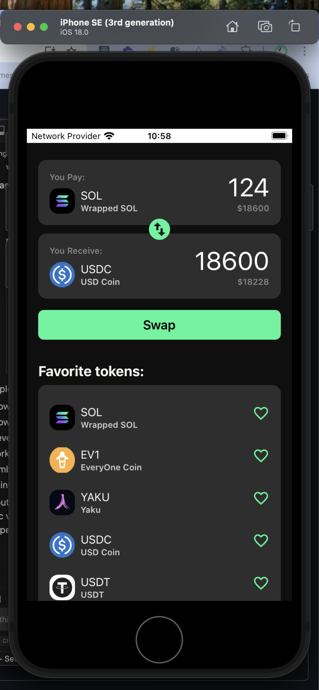

# Welcome to Solana-swap app 👋

This is an [Expo](https://expo.dev) project created with [`create-expo-app`](https://www.npmjs.com/package/create-expo-app).

## Table of Contents
* [General Info](#general-information)
* [Technologies Used](#technologies-used)
* [Features](#features)
* [Setup](#setup)
* [Areas for Improvement](#areas-for-improvement)

## General Information

This project is a simple swap app for Solana blockchain.

## Technologies Used

- [Expo](https://expo.dev)
- [React Native](https://reactnative.dev)
- [React Navigation](https://reactnavigation.org)
- [React Native Gesture Handler](https://github.com/kmagiera/react-native-gesture-handler)
- [React Native Reanimated](https://github.com/software-mansion/react-native-reanimated)
- [React Native Drag and Drop](https://github.com/wojtekmaj/react-native-draggable-flatlist)
- [React Native Safe Area Context](https://github.com/th3rdwave/react-native-safe-area-context)
- [React Native Screens](https://github.com/vitalets/react-native-screens)
- [React Native Web](https://github.com/necolas/react-native-web)
- [React Native Webview](https://github.com/react-native-webview/react-native-webview)

## Features

- Swap between different tokens
- Drag and drop tokens to change their order
- Favorites list

## Screenshots


## Setup

1. Install dependencies

   ```bash
   npm install
   ```

2. Start the app

   ```bash
   npx expo start
   ```

In the output, you'll find options to open the app in a

- [development build](https://docs.expo.dev/develop/development-builds/introduction/)
- [Android emulator](https://docs.expo.dev/workflow/android-studio-emulator/)
- [iOS simulator](https://docs.expo.dev/workflow/ios-simulator/)
- [Expo Go](https://expo.dev/go), a limited sandbox for trying out app development with Expo

You can start developing by editing the files inside the **app** directory. This project uses [file-based routing](https://docs.expo.dev/router/introduction).

## Areas for Improvement

Areas for improvement:
- Integrate with Solana blockchain
- More data on swap(ongoing transactions, gas fees, etc.)
- Refactor components architecture. Preferrably use atomic design. Keep consistency with clean architecture approach splitted by layers: 

```domain -> use cases -> data -> presentation(UI)```
